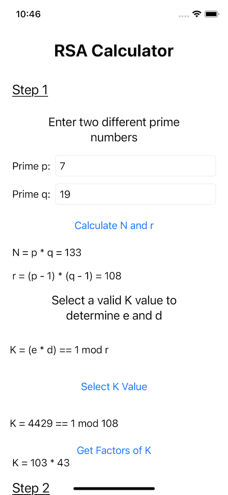
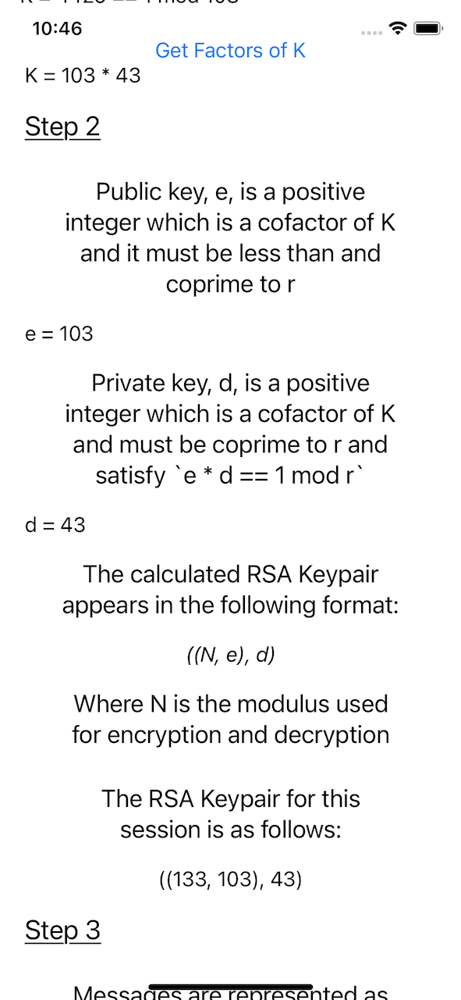
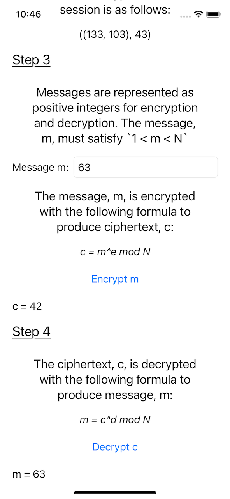

#  RSA Calculator

## Introduction
The purpose of this app is to educate users on the process of RSA key generation, encryption, and decryption. The app allows users to experiment with different values involved in the RSA process to explore how it all works.

## Program Specs
The app is implemented in SwiftUI and Combine as an iOS app. In order to support the calculations involved in RSA encryption and decryption formulas, a 
[BigInt](https://github.com/attaswift/BigInt) dependency was added.

## Implementation
The app starts by prompting the user to enter two unique prime numbers. Afterwards, N and r are calculated and displayed to the user. Next, the user chooses a valid `K` value that satisfies  `K = (e * d == 1 mod r)`. Once the user chooses a K value, the values for `K = e * d` is displayed for the user. When the user scrolls to the next step, `e` and `d` are prepoulated with descriptions of their preconditions and addressing which is the public and private key. Below there, the user is shown the standard RSA keypair generic format and the formatted keypair as calculated. Lastly, the user is able to enter a message `m` as a positive integer that satisfies the condition `1 < m < N`. Once a valid `m` value is entered, the user is shown the encryption and decryption RSA formulas, and they are able to encrypt and decrypt the message `m`.

## Screenshots

## Conclusion
RSA is a fascinating cryptographic standard, and hopefully this app has provided a way to teach those newer to modern cryptography how to calculate and utilize RSA key generation, encryption, and decryption.
